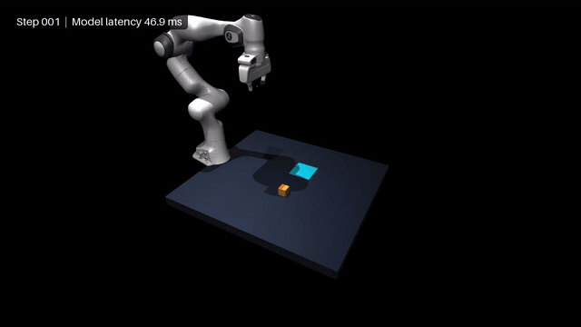

  <p align="center">
    
  </p>

<div align="center">

# 🧠 LLM2Jev：将 LLM 转换为 Jev 风格的决策模型
<br/>

[](pyproject.toml)
[](LICENSE)
[](docs/usage_zh.md)
[](docs/usage_zh.md)


**让本地语言模型成为 Jev 风格的结构化决策模型：支持文本与图片输入，仅需 prefill 即可得到结果，无需逐 token 解码。**


</div>


> LLM2Jev 是一个独立的开源项目，与 Jev 或 TypeSafe 没有关联，也未获得其认可或授权。

## 📰 最新动态

- **9月23日** - **[MLX后端](docs/usage_zh.md#offline-python-api)**：新增图文评分、候选批量执行、有界前缀缓存和兼容的 System One HTTP 服务。
- **9月22日** - **[多模态输入](docs/multimodal_zh.md)**：SGLang、Transformers 和 System One HTTP API 均支持图文请求。
- **9月21日** - **[网页和贪吃蛇 demo](#demos)**：新增用于组合多种问题和模型决策的交互式示例。
- **9月21日** - **冷启动前缀复用**：新增分阶段候选提交以复用 SGLang Radix Cache，并提供[架构说明](docs/request-to-model_zh.md)、[使用文档](docs/shared-prefix-cache_zh.md)和[性能测评](docs/shared-prefix-benchmarks_zh.md)。
- **9月20日** - **SGLang 与 System One API**：新增 SGLang 评分后端，以及兼容的 [`POST /v1/systemone`](docs/usage_zh.md#online-http-服务) 接口。


## ✨ 核心特性
- **丰富的后端支持**：支持 SGLang、Transformers 和 Apple Silicon 上的 MLX，可通过 Python API 或 HTTP 服务运行本地文本及图文模型。
- **仅需 prefill**：在 prefill 阶段读取 logits 计算概率并直接组装结果，无需逐 token 解码。
- **多模态输入**：支持在 `state` 或 `instructions` 中组合文字与图片，可使用 SGLang、Transformers 或 MLX-VLM 后端。
- **选项顺序无关**：每个 Choice 候选都会独立评估，调整选项顺序不会引入位置偏好或改变各选项的分数。
- **冷启动前缀复用**：通过分阶段提交，在单次请求内复用 SGLang 的 Radix Cache，首次请求没有相关历史缓存时也能利用共享前缀。

所有候选共享 `state`，同一道题的候选还共享 `instructions`。SGLang 后端先评分一个真实的 `criteria` 候选来建立前缀缓存，再提交能够复用它的其他候选。每个候选只评分一次，减少长输入、多候选场景中的重复计算。MLX后端会先显式预热共享前缀，再评分候选后缀。


了解工作原理：[从 Jev Request 到 LLM Request](docs/request-to-model_zh.md) → [共享前缀设计](docs/shared-prefix-cache_zh.md)。


## 🚀 快速开始

在配有受支持 NVIDIA GPU 的 Linux 环境中，使用 SGLang 运行本地模型：

```bash
git clone https://github.com/Yinsongxu/LLM2Jev.git
cd LLM2Jev
uv sync --extra sglang
source .venv/bin/activate
python examples/sglang_inference.py --model-path /path/to/model
```

示例会提交 Choice、Score 和 Noul 三种问题，并将响应输出为 JSON。
请将 `/path/to/model` 替换为本地 Hugging Face 兼容的因果语言模型目录。

图片服务使用详见[多模态输入](docs/multimodal_zh.md)。

## 📦 安装

环境要求、SGLang、Transformers 与 MLX 依赖，以及 uv、pip 安装方式见[安装指南](docs/installation_zh.md)。

## 📖 使用入门

完整示例见[使用指南](docs/usage_zh.md)：

- [Offline：Python API](docs/usage_zh.md#offline-python-api)
- [Apple Silicon 的 MLX 后端](docs/usage_zh.md#offline-python-api)
- [Online：HTTP 服务](docs/usage_zh.md#online-http-服务)
- [`staged` 与 `all` 的选择](docs/usage_zh.md#如何选择-staged-或-all)
- [多模态输入](docs/multimodal_zh.md)

<a id="demos"></a>

## 🎮 Demos

<table>
  <tr>
    <td align="center" valign="middle" width="67%"></td>
    <td align="center" valign="middle" width="33%"></td>
  </tr>
  <tr>
    <td align="center"><a href="demos/web/README.md"><strong>网页 demo</strong></a></td>
    <td align="center"><a href="demos/snake.py"><strong>贪吃蛇 demo</strong></a></td>
  </tr>
  <tr>
    <td align="center" valign="middle"><br><a href="demos/pick_place/README.md"><strong>MuJoCo 机械臂抓取放置 demo</strong></a></td>
    <td></td>
  </tr>
</table>


## 📊 性能测评

[性能测评](docs/shared-prefix-benchmarks_zh.md)记录了 Qwen3-1.7B / RTX 5090 的测试条件、实测数据，以及冷缓存和热缓存下 `staged` 与 `all` 的比较。收益取决于输入长度、候选数量和缓存状态。

## 🗺️ 近期规划

- [ ] 更多 benchmark：覆盖不同模型规模、数据集和工作负载，评估判断质量、延迟与吞吐量。
- [x] 网页 demo：交互式提交问题并查看概率结果。
- [x] Transformers 和 SGLang 的首版本地图片支持。
- [ ] 更多多模态任务及 demo。

## 🧪 测试

```bash
python -m unittest discover -s tests -v
```

## 📄 许可证

本项目基于 [Apache License 2.0](LICENSE) 发布。
